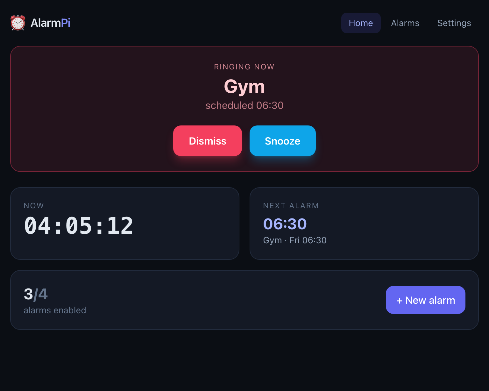
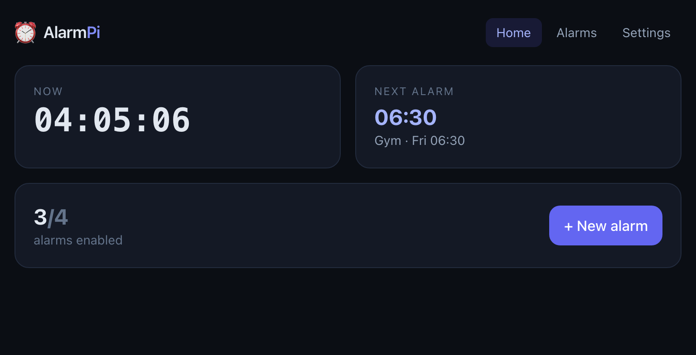
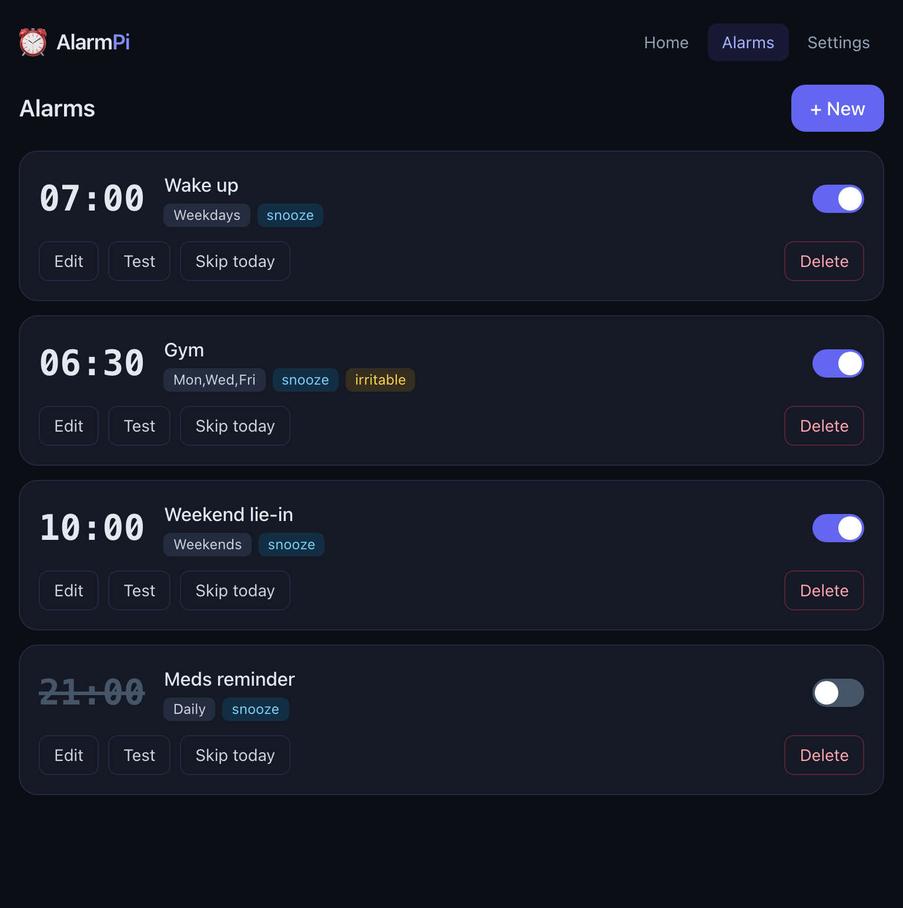
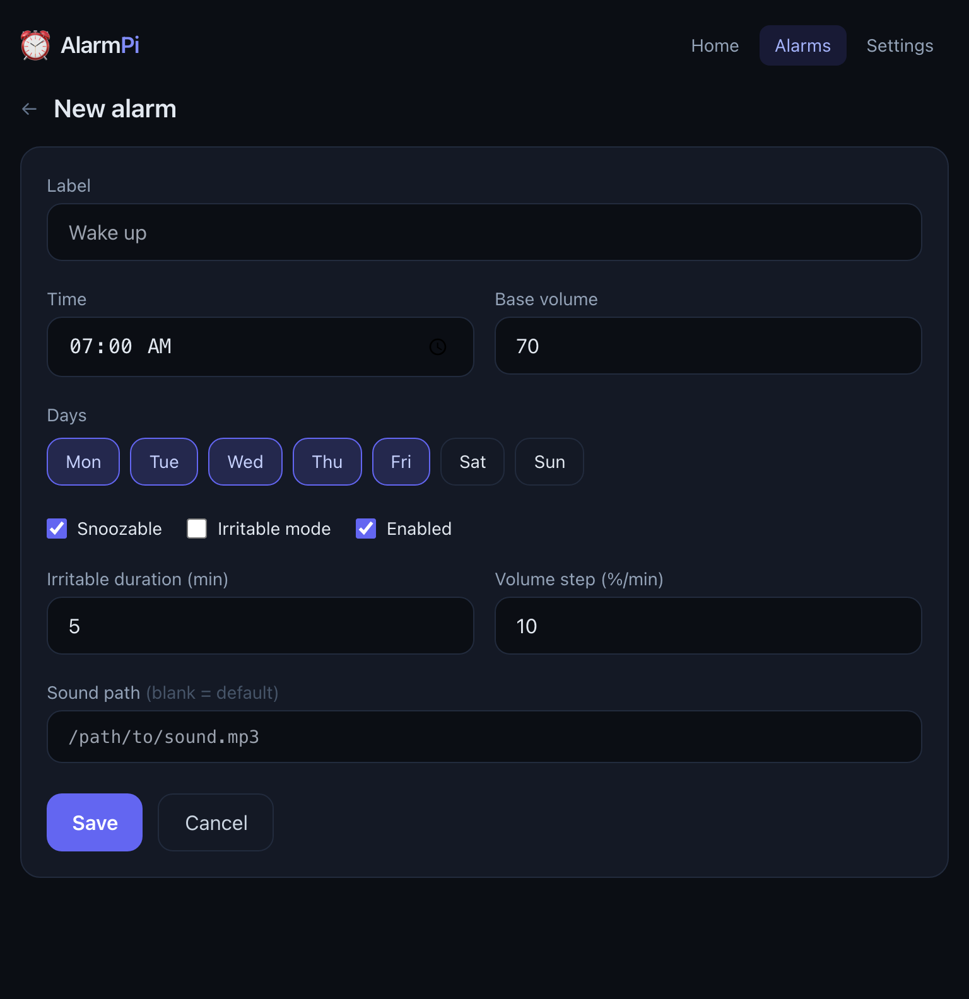
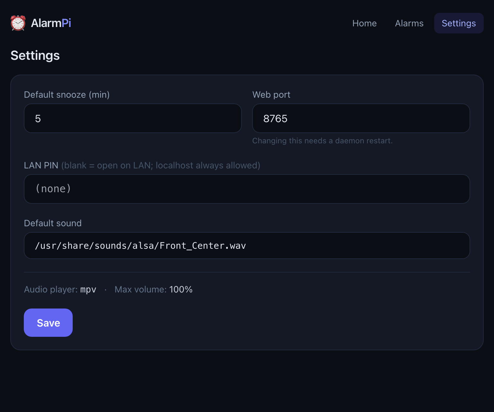
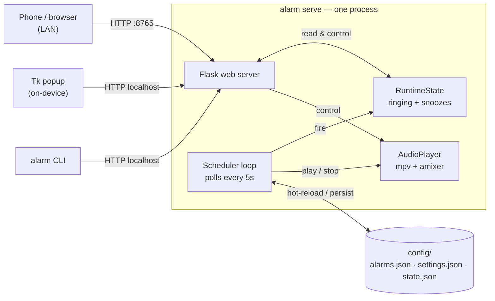

<div align="center">

# ⏰ AlarmPi

**A headless alarm clock for the Raspberry Pi — driven by a clean CLI and a Tailwind LAN web UI.**

Set alarms from your terminal, control them from your phone, and silence a ringing alarm from anywhere on your network.

[](https://github.com/kleinpanic/alarm-pi/actions/workflows/ci.yml)
[](LICENSE)




</div>

---

## Contents

- [Why](#why)
- [Features](#features)
- [Screenshots](#screenshots)
- [Architecture](#architecture)
- [Install](#install)
- [Configuration](#configuration)
- [CLI reference](#cli-reference)
- [Web UI & API](#web-ui--api)
- [How it works](#how-it-works)
- [Development](#development)
- [Project layout](#project-layout)
- [License](#license)

## Why

A Raspberry Pi makes a great always-on bedside alarm — but a headless Pi has no
screen to tap "snooze." AlarmPi solves that: a background daemon rings the
alarm (escalating volume optional), and you dismiss or snooze it from your
phone's browser, the terminal, or an on-device popup. One daemon, three ways to
control it, all sharing the same state.

## Features

- **Packaged CLI** — `alarm list/add/edit/enable/disable/delete/skip/next`, plus runtime `status/dismiss/snooze/test` and service `serve/start/stop`.
- **LAN web UI** — Tailwind, mobile-first. Manage alarms and **dismiss/snooze a ringing alarm remotely**.
- **On-device popup** — Tkinter STOP/SNOOZE window when a display is attached (optional, auto-detected).
- **Irritable mode** — volume escalates each minute until you get up.
- **Snooze that survives restarts** — pending snoozes are persisted to disk.
- **Flexible scheduling** — per-day-of-week, skip-dates, per-alarm sounds and volume.
- **Safe config** — atomic, file-locked JSON writes; live hot-reload on change.
- **Optional PIN** — gate the UI for other LAN hosts; localhost always bypasses.
- **Tested & scanned** — pytest suite in CI across Python 3.10–3.12, gitleaks secret scanning.

## Screenshots

| Dashboard | Ringing |
|---|---|
|  |  |

| Alarms | Add / edit |
|---|---|
|  |  |

<div align="center"></div>

## Architecture

A single process runs the scheduler loop **and** the web server, sharing one
thread-safe `RuntimeState`. Every control surface — browser, on-device popup,
and CLI — funnels dismiss/snooze/test through the same local HTTP API, so there
is exactly one code path.



## Install

```bash
git clone https://github.com/kleinpanic/alarm-pi.git
cd alarm-pi
python3 -m venv .venv
.venv/bin/pip install -e .          # installs Flask + the `alarm` command

# seed local config from the examples (these files are gitignored)
cp config/settings.example.json config/settings.json
cp config/alarms.example.json   config/alarms.json

.venv/bin/alarm install             # install the systemd user unit
systemctl --user enable --now alarm-daemon.service
```

The daemon serves the web UI on `http://<pi-lan-ip>:8765`. If you skip the `cp`
step it creates default config on first run.

**System packages:** `sudo apt install mpv alsa-utils` (playback + volume).
An X display is only needed for the on-device popup.

## Configuration

Runtime config lives in `config/` and is **gitignored** (it holds your personal
schedule). Versioned templates are provided:

- `config/alarms.example.json` — alarm definitions
- `config/settings.example.json` — audio / web / snooze settings

Edits to `alarms.json` and `settings.json` are hot-reloaded by the running
daemon, so CLI and web changes apply live. `default_sound` may be absolute or
relative to the project root.

## CLI reference

```bash
# config (daemon hot-reloads)
alarm list
alarm add --label "Wake up" --time 07:00 --days weekdays
alarm add --label "Gym" --time 06:30 --days mon,wed,fri --irritable
alarm edit 1 --time 07:30
alarm enable 1 | alarm disable 1 | alarm delete 1
alarm skip 1 tomorrow
alarm next

# runtime (talks to the running daemon)
alarm status
alarm dismiss
alarm snooze --minutes 10
alarm test 1

# service
alarm serve            # run in foreground
alarm start | stop | restart
```

`--days` accepts `0-6` (0=Mon), day names (`mon,wed`), or `weekdays` /
`weekends` / `daily`.

## Web UI & API

Pages: `/` dashboard · `/alarms` · `/alarms/new` · `/alarms/<id>/edit` · `/settings`

| Method | Endpoint | Purpose |
|---|---|---|
| GET | `/api/status` | clock, next alarm, ringing state, counts |
| GET | `/api/alarms` | list alarms |
| POST | `/api/alarms` | create alarm |
| PUT | `/api/alarms/<id>` | update alarm |
| DELETE | `/api/alarms/<id>` | delete alarm |
| POST | `/api/alarms/<id>/enable` · `/disable` · `/skip` · `/test` | per-alarm actions |
| POST | `/api/ringing/dismiss` · `/snooze` | control the ringing alarm |
| GET | `/api/settings` | read settings |

**PIN:** blank by default (open on a trusted LAN). Set a PIN in Settings to gate
other hosts; requests from `127.0.0.1` always bypass it, so the popup and CLI
never need it.

## How it works

1. The scheduler loop checks alarms every few seconds. When one matches the
   current minute (and day, and isn't skipped), it sets the shared ringing state
   and starts audio — without blocking.
2. The web server reads that state; the dashboard polls `/api/status` and shows
   a live RINGING banner.
3. Dismiss/snooze from any surface hits the daemon, which stops audio, closes
   the popup, and clears or reschedules the alarm. Snoozes persist to
   `state.json`, so a restart never loses them.

## Development

```bash
python3 -m venv .venv
.venv/bin/pip install -e ".[dev]"   # flask + pytest + pre-commit
.venv/bin/python -m pytest          # run the test suite
pre-commit install                  # local gitleaks + pytest hooks
```

CI runs the same `pytest` suite across Python 3.10–3.12 plus a
[gitleaks](https://github.com/gitleaks/gitleaks) secret scan over full history.
The pre-commit hooks mirror CI, so local commits and CI catch the same issues.

## Project layout

```
alarm/
  cli.py          packaged `alarm` entrypoint
  daemon_core.py  scheduler loop + web thread + non-blocking firing + control
  scheduler.py    time/day/skip matching, snooze
  state.py        thread-safe runtime state (ringing + snoozes), persisted
  audio.py        mpv playback + amixer volume escalation
  popup.py        standalone Tk popup (buttons POST to the local API)
  config.py       atomic, locked JSON I/O
  models.py       Alarm, Settings
  web/            Flask app + Jinja2/Tailwind templates
config/           *.example.json templates (real config is gitignored)
systemd/          alarm-daemon.service (user unit)
docs/             design spec + screenshots
tests/            pytest
```

## License

[MIT](LICENSE) © 2026 Klein Panic
